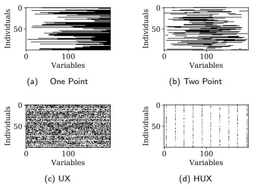

## Python 多目标优化

Felix Li • <a href="mailto:felix.li12397@gmail.com">felix.li12397@gmail.com</a>

---

## Pymoo介绍

- 优化 -> 工程、数据、科学、人工智能
- 相关作品：jMetalPy、PyGMO、Platypus、DEAP、Inspyred
- Pymoo同时: 多目标优化、可视化、做决策
- 模块化和可扩展性：“即插即用”设计

---

## 问题表述

---

## 帕累托前沿（假设）

- 两个目标：
  - 最大化速度
  - 最大化燃油效率
- F1赛车很快，但燃油效率极差
- 丰田普锐斯很省油，但很慢
- 一些跑车是一个平衡：相当快，也相对高效

---

## 问题表述

- 两个变量、目标、约束

---

## Pymoo建筑

---

## 建筑主要模块

1.	Problems（处理问题）
  -	问题设计的启示，自动微分梯度和并行化计算

2.	Optimization (优化)
  -	为算法提供了进化算子、处理约束的方法、分解策略以及终止准则

3.	Analytics（分析）
  -	提供可视化、性能指标和决策支持工具

---

## Problems（处理问题）

-	提供测试问题（单目标、多目标、超多目标），用于算法开发和基准测试
-	问题的梯度都使用自动微分 (Autograd) 自动计算
-	只需在输出请求中添加一个 "d" (return_value_of = ["F", "dF"] )

---

## Problems（处理问题）

### 并行化计算

-	pymoo 提供了多种内置策略来实现并行化：
  - 向量化（vectorize）：使用NumPy操作来同时处理整个种群矩阵
  - 多线程（threaded）：使用爬虫的线程池来并行评估种群中的每个解
  - 分布式（Dask）： 将不同的解发送到不同的机器上进行评估

---

## Optimization（优化）：进化算子

---

## Sampling（采取）

- 目的：创建候选解的初始种群
- 支持对实数、整数、和而今此变量的随机采样
- 还为实数变量提供**拉丁超立方采样**（LHS）

---

## Crossover（交叉）

- 目的：结合两个父代的遗传信息创新新的后代
1. 二进制/字符串变量：
  - 使用经典算子：单点、两点、均匀 (UX)、拌均匀 (HUX)
  - 原理：交换片段或随机从每个附带选择位

---

## Crossover（交叉）

---

## Crossover（交叉）

2. 实值变量：使用**模拟二进制交叉**（SBX）
3. 整数变量：使用SBX的修改版本、通过舍入来适应离散值

---

## Mutation（变异）

- 目的：随机修改一个接，引入新的遗传物质并保持种群多样性
1. 实数和整数变量：**多项式编译**对值进行小的随机改变
2. 二进制变量：**比特翻转变异**将一个位从0反转到1

---

## Termination Criterion（停止条件）

- 防止无限计算
- 简单方法：例如最大函数评估次数、送代次数
- 高级方法：例如跟踪最近几代中解的位置、目标值的变化
- 假如：检查解在代与代之间的最大移动量；该移动量在k代内都低于某个阈值 -> 停止

---

## Decomposition（分解）

- 目的：通过多目标问题分解为一组单目标子问题
- 分解方法（通过**勒贝格空间**）：
  - 加权和法（p=1）：简单，但无法处理有非凸帕累托前沿的问题
  - 切比雪夫（p=∞）和ASF/AASF：专注于最小化与理想点的最坏情况偏差
  - PBI：平衡了想帕累托前沿的收敛性和前沿的多样性
 - **重要**：对目标值进行适当的规范化

---

