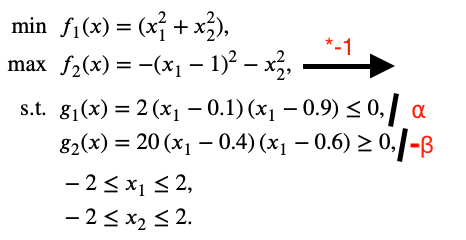

## Python 多目标优化

Felix Li • <a href="mailto:felix.li12397@gmail.com">felix.li12397@gmail.com</a>

---

## Pymoo介绍

- 优化 -> 工程、数据、科学、人工智能
- 相关作品：jMetalPy、PyGMO、Platypus、DEAP、Inspyred
- Pymoo同时: 多目标优化、可视化、做决策
- 模块化和可扩展性：“即插即用”设计

---

## 问题表述

---

## 帕累托前沿（假设）

---

## 帕累托前沿（假设）

- 两个目标：
  - 最大化速度
  - 最大化燃油效率
- F1赛车很快，但燃油效率极差
- 丰田普锐斯很省油，但很慢
- 一些跑车是一个平衡：相当快，也相对高效

---

## 帕累托前沿

- 目的：
  - 发现尽可能多的这些最优权衡解
  - 将它们均匀地分散在整个前沿上
- 帕累托前沿就是所有这些“最优权衡”汽车的集合
- pymoo 中多目标优化的整个目的就是找到帕累托前沿

---

---

## 问题表述

- 两个变量、目标、约束

---

## 问题可视化

---

## pymoo 重构步骤

1. 所有目标必须被最小化
2. 所有约束必须是 "≤" 类型
3. 建议进行归一化

---

⍺ = 2 ⋅ (−0.1) ⋅ (−0.9) = 0.18  
Β = 20 ⋅ (−0.4) ⋅ (−0.6) = 4.8

---

---

## 代码实现

- **__init__** 方法定义了问题的元属性
- **_evaluate** 方法定义了实际的计算
- 向量化： 代码使用 NumPy 操作对整个输入数组 x（包含整个种群）进行计算

---

---

## Pymoo架构

---

## 建筑主要模块

1. Problems（处理问题）
    -	问题设计的启示，自动微分梯度和并行化计算

2. Optimization (优化）
    -	为算法提供了进化算子、处理约束的方法、分解策略以及终止准则

3. Analytics（分析）
    -	提供可视化、性能指标和决策支持工具

---

## Problems（处理问题）

-	提供测试问题（单目标、多目标、超多目标），用于算法开发和基准测试
-	问题的梯度都使用自动微分 (Autograd) 自动计算
-	只需在输出请求中添加一个 "d" (return_value_of = ["F", "dF"])

---

## Problems（处理问题）

### 并行化计算

- pymoo提供了多种内置策略来实现并行化：
    - 向量化（vectorize）：使用NumPy操作来同时处理整个种群矩阵
    - 多线程（threaded）：使用Python的线程池来并行评估种群中的每个解
    - 分布式（Dask）： 将不同的解发送到不同的机器上进行评估

---

## Optimization（优化）：进化算子

---

## Sampling（采样）

- 目的：创建候选解的初始种群
- 支持对实数、整数、和而今此变量的随机采样
- 还为实数变量提供**拉丁超立方采样**（LHS）

---

---

## Crossover（交叉）

- 目的：结合两个父代的遗传信息创新新的后代
    1. 二进制/字符串变量：
        - 使用经典算子：单点、两点、均匀 (UX)、半均匀 (HUX)
        - 原理：交换片段或随机从每个附带选择位

---

## Crossover（交叉）

---

## Crossover（交叉）

2. 实值变量：使用**模拟二进制交叉**（SBX）
3. 整数变量：使用SBX的修改版本、通过舍入来适应离散值

---

## Mutation（变异）

- 目的：随机修改一个接，引入新的遗传物质并保持种群多样性
1. 实数和整数变量：**多项式编译**对值进行小的随机改变
2. 二进制变量：**比特翻转变异**将一个位从0反转到1

---

## Termination Criterion（停止条件）

- 防止无限计算
- 简单方法：例如最大函数评估次数、送代次数
- 高级方法：例如跟踪最近几代中解的位置、目标值的变化
- 假如：检查解在代与代之间的最大移动量；该移动量在k代内都低于某个阈值 -> 停止

---

## Decomposition（分解）

- 目的：通过多目标问题分解为一组单目标子问题
- 分解方法（通过**勒贝格空间**）：
  - 加权和法（p=1）：简单，但无法处理有非凸帕累托前沿的问题
  - 切比雪夫（p=∞）和ASF/AASF：专注于最小化与理想点的最坏情况偏差
  - PBI：平衡了想帕累托前沿的收敛性和前沿的多样性
- **重要**：对目标值进行适当的规范化

---

## 代码实现算法

-	"real_pm" ->  多项式编译
-	Eta  ->  控制变异强度或破坏性程度

---

## 代码实现优化

-	('n_gen', 40)  ->  停止条件：在固定代数后终止
-	Seed  ->  可重复性
-	Verbose  ->  提供算法进度的实时反馈
---

## 优化结果

---

## 单目标进化算子

---

## 遗传算法（GE）
- 在一个个体（解）的种群上运行，每个个体通常表示为二进制字符串
- 算法通过三个主要算子迭代地改进种群：
    1. 筛选：表现更好的个体（适应度）有更高的机会被选为“父母”
    2. 交叉：产生一个或两个后代，遗传物质。常见的方法是单点交叉（在字符串中随机选择一个点，并将该点之后的片段在两个父代之间交换）
    3. 变异：对后代的基因施加一个小的随机变化

---

## 差分进化（DE）

- 优势：在实值优化问题上表现卓越
- 通过计算种群中其他随机选择的成员之间的向量差，并将这个缩放后的差值加到第三个成员上来生成新的候选解

---

- X -> 种群成员
- F -> 一个缩放因子
- V -> “供体”或“突变”向量

---

- V供体向量通过交叉操作与一个“目标”向量混合
- 得到一个“试验”向量
- 试验向量与目标向量竞争下一代中的位置
- 在搜索空间中非常高效

---

## 单目标直接搜索算法（无梯度）

---

## 单纯形法（Nelder-Mead）

- 在一个单纯形上运行：
- 在N维中，一个单纯形有N+1个顶点
- 例如：2D中的三角形，3D中的四面体
- 每个顶点代表一个候选解

---

该算法通过反射、扩展或收缩来迭代地变换这个单纯形，使其远离最差点  
基本操作是：
- 反射：将最差点移动通过单纯形的对侧面
- 扩展：如果反射点很好，则朝该方向移动得更远
- 收缩：如果反射点很差，则少移动一些
- 缩小：如果其他方法都失败，则将整个单纯形向最优点收缩

限制：可能会陷入停滞，并且缺乏对高维问题的强大理论收敛保证

---

## 模式搜索（Pattern search）

- 模式搜索是直接搜索算法的一个系列，也称为“探索性移动”
- 在当前迭代点周围的点上探测目标函数
- 根据特定的模式（例如，坐标轴：x + Δ, x - Δ, y + Δ, y - Δ 等）
- 过程有两个主要步骤：
    1. 搜索：在模式中测试点，看是否有任何点能产生更好的解。有就移动到那里
    2. 探测：如果搜索步骤失败，模式通常保持不变，但步长 Δ 可能会减小
- 好处：简单、稳健，并且具有良好的收敛特性

---

## Analytics（分析）

---

## Performance indicator (性能指标）

1. GD（世代距离）:
    - 衡量：收敛性（与最优值的距离）
    - 计算每个找到的解到真实前沿上最近点的平均距离
    - GD值低 = 收敛性好

---

2. IGD+（反转世代距离）:
    - 衡量：收敛性与多样性（分布和覆盖度）
    - 计算真实前沿上每个点到最近找到解的平均距离
    - IGD值低 = 覆盖度和收敛性好

3. Hypervolume（超体积）:
    - 整体质量（支配空间的体积）
    - 计算被找到的解集所支配的客观空间的体积
    - 超体积大 = 解集既收敛良好又分布良好
    - 限制：计算成本可能很高

---

---

## Visualization（可视化）
- 直观理解 -> 散点图 2D/3D
- 多目标 -> 成对散点图
- 超多目标 -> 平行坐标图 (PCP)、Radviz、星形坐标图
- **强调**：对目标值进行归一化

---

## Decision making（决策）

---

## 1. 妥协规划

-	使用优化模块中的标量化函数（如加权和、切比雪夫、ASF）
-	用户提供反映其偏好的权重
-	选择具有最佳标量化得分的解

---

## 2. 伪权重

-	计算为了使用加权和法，每个目标本应具有的有效“权重”
-	计算每个目标应具有的有效“权重”
-	使用加权和方法选择某个给定解
-	这有助于决策者理解集合中任何解所隐含的权衡

---

---

-	伪权重：[0.51, 0.49]

---

## 3. 高权衡解

- 识别最“有趣”的解
-	特点是在一个目标上的微小改进需要以另一个目标上的巨大牺牲为代价

---

### 两两权衡度 (T)

-	计算了从解 A 移动到解 B 所需的牺牲与收益的比率
-	高的 T  ->  巨大的牺牲，微小的收益
-	低的 T  ->  微小的牺牲，巨大的收益

---

### 整体权衡度 (μ)

-	对于一个解 A，我们计算它与其他所有解之间的 T(A, B)、T(A, C) 等值
-	μ(A,S) 是这些 T 值中的最小值
-	最终决策选μ(A,S)最大的值

---

## 多目标进化算法

---

## NSGA-II（非支配排序遗传算法 II）

1. 非支配排序
    - 将整个种群进行排序
2. 拥挤度计算
    - 在每个等级内，根据方案的“独特性”进行选择  
3. 交叉

---

---

---

## NSGA-III

- 提高NSGA-II在多目标优化问题（有4个或更多目标）
1. 用基于参考线的小生境机制取代了拥挤度
    - 一组均匀分布的参考点（或线）被预先定义在整个超平面上
2. 算法将每个种群成员与一个参考线相关联
3. 选择首先基于非支配等级，然后基于相关参考线的小生境数量

---

## MOEA/D（基于分解的多目标进化算法）

-	它为每个权重向量创建一个“小目标”或子问题
-	该向量指定了一种偏好
-	优点：非常高效，收敛速度可能更快

---

## MOEA/D 过程

-	每个子问题由一个“专家”解决
-	该专家寻找符合其特定目标的最佳汽车
-	这些相邻的专家会共享信息："90% 价格”专家找到的超便宜汽车，告知其邻近的“50/50”专家
- 后者可能利用该信息找到一款便宜且相当高效的汽车

---

## SPEA2（强度帕累托进化算法 2）

- 优点：其精英档案通常能产生一组非常高质量、多样化的解
    1. 维护一个精英档案
        - SPEA2 维护两个组：一个主种群和一个精英档案
        - 精英档案：保存目前找到的最佳非支配解

---

2. 强度和原始适应度:
    - 为档案和种群中的每个解分配一个**强度值**
    - 该值基于它支配了多少其他解
    - 根据所有支配它的解的强度之和计算每个解的**原始适应度**
    - 高原始适应度 = 不好  
3. 密度估计
    - 添加一个密度度量（如拥挤度）
    - 选择具有最佳（最低）综合原始适应度和密度得分的个体

---

### 哪一个算法适合优化 E-NE 和 A-NE？

---

### 条目至最近条目(E-NE)

- 每个选定种质与最近其他条目间的平均距离  
- 最大化 → 高度多样化的核心集合  

---

### 全库至最近条目(A-NE)

- 每个种质与最相似核心条目的平均距离  
- 最小化 → 能最佳代表完整集合中所有个体种质的核心集合  

---

## 最适合优化 E-NE 和 A-NE的算法

1. NSGA-II
    - 好处：稳健性强、分布性良好的解集、文档和社区支持非常完善
    - 限制：对于超大规模问题可能较慢；需要进行一些参数调优
2. NSGA-III
    - 好处：增加第三个目标（如等位基因丰富度）
    - 限制：设置更复杂，对二维目标显得有些大材小用
3. MOEA/D
    - 好处：收敛速度快，计算高效，扩展性较好
    - 限制：设置权重向量、表现依赖于所选的标量化函数

---

## 总结

- pymoo 提供完整框架：从问题定义、算法选择到分析和决策
- 为研究与工业应用而设计
- 未来是自动化与易用性的
